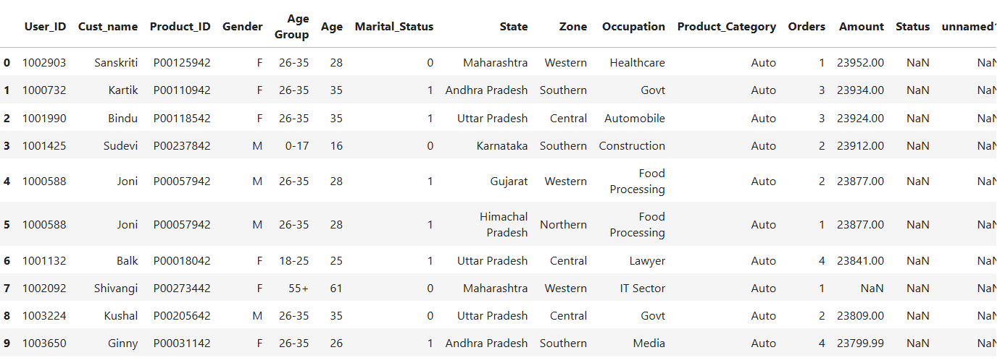

# Diwali-Sales-EDA
# 📊 Diwali Sales Data Analysis

This project performs **Exploratory Data Analysis (EDA)** on Diwali sales data using Python libraries such as Pandas, NumPy, Matplotlib, and Seaborn. The aim is to extract actionable insights into consumer behavior during the Diwali festival season.

---

## 📁 Dataset

The dataset `Diwali Sales Data.csv` includes:

- Customer demographics (Gender, Age Group, Marital Status, etc.)
- Purchase behavior (Product Categories, Amount spent)
- Geographic information (City, State)

---

## 🔧 Tools & Libraries Used

- Python
- Jupyter Notebook
- Pandas – for data manipulation
- NumPy – for numerical computations
- Matplotlib – for basic visualizations
- Seaborn – for advanced plotting

---

## 🔍 EDA Objectives

- Clean and preprocess the dataset by handling null values and dropping unnecessary columns.
- Analyze customer spending habits based on gender, age group, and marital status.
- Identify high-performing states and cities in terms of sales.
- Visualize key trends and patterns using various types of plots.

---

## 📌 Key Insights

- **Female customers** contributed significantly to overall Diwali sales.
- **Married individuals** were more active in shopping than unmarried ones.
- Top performing states include **Uttar Pradesh**, **Maharashtra**, and **Karnataka**.
- Category-wise and demographic-wise analysis suggests strong potential for **targeted marketing strategies**.

---

## ✅ Conclusion

This EDA project revealed important patterns in festive season shopping behavior, helping businesses make data-driven decisions to improve customer engagement, optimize inventory, and personalize marketing during Diwali campaigns.

---

## 🚀 How to Run

1. Clone the repository:
   ```bash
   git clone https://github.com/your-username/Diwali-Sales-EDA.git
